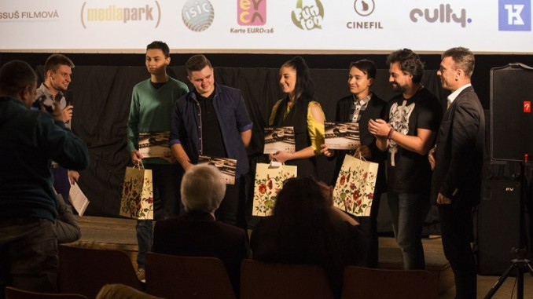

# How I started:

- [**"We want to live!"**](https://www.youtube.com/watch?v=3V1NKcxF2OI) (I was 14 years old) –> I entered my first animated LEGO short film into a Bratislava Slovak competition. We were awarded with 3rd place. I believe that we won thanks to the cooperation of my friends.

  
- [**"World of Plastic"**](https://www.youtube.com/watch?v=VX3JhoW89X4) (2016 – 15 years old) –> Animated LEGO short film. We were awarded 1st place in the Bratislava Slovak competition. (I was 15 years old) –> Animated LEGO short film. We were awarded 1st place in the Bratislava Slovak competition.

- [**"Life with ISIC"**](https://www.youtube.com/watch?v=07TXVp8rjss&t=9s) (I was 16 years old) –> Music video about ISIC student card. We were awarded 1st place in the Košice Slovak competition. Thanks to this, I had the opportunity to be the main actor in short ISIC ads.

- [**"Mystery House trailer"**](https://www.youtube.com/watch?v=FhtPwFmSkp4) (2017 – I was 16 years old) –> We were awarded 1st place in Czechoslovak competition.

  
- [**"1 DAY"**](https://www.youtube.com/watch?v=v6IRnz5T7lA) (I was 18 years old) –> Live-action short film. We were awarded 2nd place in the Košice Slovak competition.

# What happened in 2020:

In 2020, word about me and my work reached some people, leading me to create videos for clients. Over time, I created my first international short film, blending live-action and animated elements. Garnering awards and nominations, I chose to step into the background actor role, gaining insights into larger-scale film productions. 

Subsequently, I became an Animation/Film instructor for a kids' camp, held annually for one week. Currently, I'm gaining valuable experience as an intern in Berlin with Erasmus+. During this period, I'm also preparing a new music video. To see more, [click](https://github.com/BenjaminHaverla/My-Work.git) without hesitation.

-------------------------------------------------------------

# BACK TO THE:
## [Main Page (English for designers)](https://github.com/BenjaminHaverla/English-for-designers.git)
## [Benjamín Haverla – Who am I ?](https://github.com/BenjaminHaverla/First-impression.git)
# Contact me:
## **Mail**: haverla.tros@gmail.com
